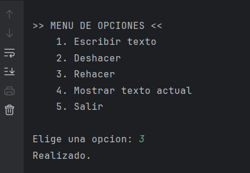

## Objetivo del proyecto.
Comprender el concepto de pilas a traves de un aplicativo en consola que simula un deshacer/rehacer.

## Conceptos.
Una pila (stack) es una estructura de datos que sigue el principio LIFO (Last In, First Out → el último en entrar es el primero en salir).
Se puede implementar con la clase Stack<E> de la librería estándar (java.util.Stack).

- Características principales:

  - push(elemento) → añade un elemento a la pila.
  - pop() → elimina y devuelve el último elemento agregado.
  - peek() → devuelve el último elemento sin eliminarlo.
  - empty() → comprueba si la pila está vacía.

## Instrucciones de ejecución.
1. Clonar repositorio HTTPS:
    ```bash 
      git clone https://github.com/Yasurigalaraga/ActividadPilas2.git
    ```
2. Podras compirarlo siguiendo una de estas opciones:
   1. Usando *Intellij IDA* podras compilar y ejecutar de forma rapida. (Recomendado)
   2. Usando comandos de Java podras compilarlo y ejecutarlo.
      1. Ir al directorio del proyecto:
         ```bash 
          cd ruta/del/proyecto 
         ```
      2. Compilar: 
         ```bash 
          javac -d bin src/*.java
         ```
      1. Ejecutar:
         ```bash 
          java -cp bin Main
         ```
## Capturas de pantalla de la ejecución.
   1. Menu opcion 1:

      

   2. Menu opcion 2:

      

   3. Menu opcion 3:

      

   4. Menu opcion 4:

      

   5. Menu opcion 5:

      


## Contribuyentes .
| Usuario                                              | Rol                                |
|------------------------------------------------------|------------------------------------|
| [@Yasurigalaraga](https://github.com/Yasurigalaraga) | Documentacion, Desarrollo y Diseño |